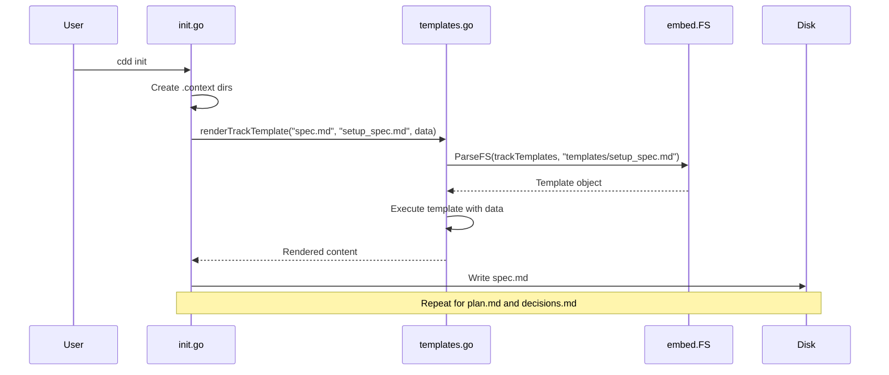

# Implementation Journal
> Created Tue Jan 13 14:26:50 -03 2026

## Technical Architecture

### System Components
- **`internal/cmd/templates.go`**: New shared module containing template rendering logic
  - `trackTemplates embed.FS`: Embedded filesystem containing all track template files
  - `trackData` struct: Data structure for template variables (TrackName, CreatedAt)
  - `renderTrackTemplate()`: Function to parse and execute Go templates
  
- **`internal/cmd/init.go`**: Initialization command (refactored)
  - Uses shared `trackData` and `renderTrackTemplate` from `templates.go`
  - Creates `.context` directory structure
  - Auto-starts the `setup` track with rendered templates
  
- **`internal/cmd/start.go`**: Track creation command (refactored)
  - Uses shared `trackData` and `renderTrackTemplate` from `templates.go`
  - Removed duplicate code (embed directive, struct, function)

### Data Flow
1. User runs `cdd init` or `cdd start <track-name>`
2. Command creates `trackData` struct with track name and timestamp
3. `renderTrackTemplate()` is called for each template file (spec.md, plan.md, decisions.md)
4. Function uses `template.ParseFS()` to read from embedded `trackTemplates`
5. Template is executed with `trackData` to produce final content
6. Rendered content is written to the track directory

### Integration Points
- **Go embed package**: Used to embed template files at compile time
- **text/template package**: Used for template parsing and execution
- **Template files**: `internal/cmd/templates/*.md` files are embedded into the binary

## Sequence Diagrams

## Implementation Considerations

### Approach
- **DRY Principle**: Extracted duplicate code from `init.go` and `start.go` into a shared `templates.go` file
- **Single Source of Truth**: Template rendering logic now exists in one place
- **Embedded Templates**: Using Go's `embed` package ensures templates are compiled into the binary
- **Backward Compatibility**: No changes to the public API or user-facing behavior

### Technical Constraints
- Go's `embed` directive must be at package level (cannot be in a function)
- Template files must exist at compile time in the `internal/cmd/templates/` directory
- The `//go:embed` directive must directly precede the variable declaration

### Trade-offs
- **Pro**: Eliminated code duplication between `init.go` and `start.go`
- **Pro**: Easier to maintain - template logic in one place
- **Pro**: Better testability - shared code can be tested once
- **Con**: Slight increase in package-level variables (embed.FS)
- **Neutral**: No performance impact - embed happens at compile time

### Performance Implications
- **Compile Time**: Templates are embedded at compile time, no runtime overhead
- **Runtime**: Template parsing happens on each command execution (same as before)
- **Binary Size**: Minimal increase due to embedded template files (~2KB total)

### Security Considerations
- Templates are embedded at compile time, preventing runtime template injection
- No user-provided template paths, reducing attack surface
- Template data is sanitized by Go's `text/template` package

## Architectural Decision Records (ADRs)

### ADR-001: Extract Template Logic to Shared Module

**Context**: Both `init.go` and `start.go` had identical code for template rendering (embed directive, trackData struct, renderTrackTemplate function). This violated DRY principles and made maintenance harder.

**Decision**: Created `internal/cmd/templates.go` to hold the shared template rendering logic. Both commands now import and use this shared code.

**Consequences**:
- **Positive**: Single source of truth for template rendering
- **Positive**: Easier to add new commands that need template rendering
- **Positive**: Reduced code duplication by ~30 lines
- **Positive**: Improved test coverage (test once, use everywhere)
- **Neutral**: Added one new file to the codebase
- **Negative**: None identified

### ADR-002: Use Go Embed for Template Files

**Context**: Templates need to be accessible at runtime without requiring external file dependencies.

**Decision**: Continue using Go's `embed` package to embed template files into the binary at compile time.

**Consequences**:
- **Positive**: Single binary distribution (no external template files needed)
- **Positive**: Templates cannot be accidentally modified or deleted
- **Positive**: Faster startup (no file I/O for templates)
- **Negative**: Template changes require recompilation
- **Mitigation**: This is acceptable for a CLI tool where templates are part of the core functionality

[2026-01-13 14:34:06] Completed refactoring - extracted template logic to templates.go (commit: 1b63aa5)
