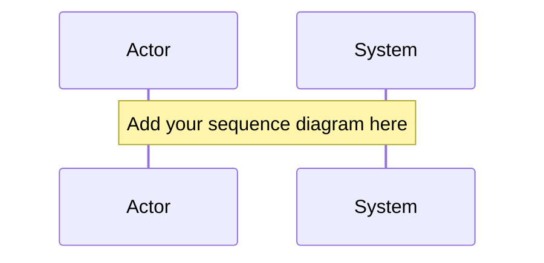

# Implementation Journal
> Created Tue Jan 13 18:27:07 -03 2026

## Technical Architecture

### System Components
<!-- Document the key components involved in this implementation -->

### Data Flow
<!-- Describe how data moves through the system -->

### Integration Points
<!-- List external systems, APIs, or modules this change interacts with -->

## Sequence Diagrams
<!-- Use mermaid or ASCII diagrams to illustrate key interactions -->

## Implementation Considerations

### Approach
<!-- Describe the overall approach taken to implement the spec -->

### Technical Constraints
<!-- List any technical limitations or constraints encountered -->

### Trade-offs
<!-- Document trade-offs made during implementation -->

### Performance Implications
<!-- Note any performance considerations or optimizations -->

### Security Considerations
<!-- Document security-related decisions or implications -->

## Architectural Decision Records (ADRs)

<!-- Use this section for significant architectural choices -->
<!-- Format: ## ADR-001: [Title] -->
<!-- Include: Context, Decision, Consequences -->
