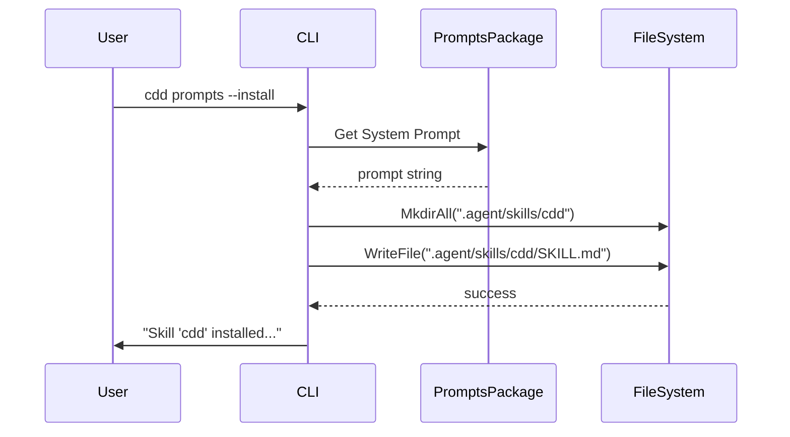

# Implementation Journal
> Created Wed Jan 14 12:02:28 -03 2026

## Technical Architecture

### System Components
- `PromptsCmd`: The cobra command that handles the `prompts` subcommand.
- `FileSystem`: Abstracted file system interface (already used in `cdd` commands) to handle directory and file creation.

### Data Flow
1. User executes `cdd prompts --install`.
2. `PromptsCmd` checks for the `--install` flag.
3. If true, it retrieves the embedded system prompt from the `prompts` package.
4. It formats the content with Agent Skill YAML frontmatter.
5. It ensures `.agent/skills/cdd/` exists.
6. It writes the result to `.agent/skills/cdd/SKILL.md`.

### Integration Points
- `cdd/internal/platform/FileSystem`: Used for all I/O operations.

## Sequence Diagrams

## Implementation Considerations

### Approach
Extend the existing `cdd prompts` command by adding a `--install` boolean flag. This is cleaner than adding a new top-level command for a single task.

### Technical Constraints
- The `name` field in `SKILL.md` frontmatter must match the directory name (`cdd`).
- Must handle cases where the directory already exists.

### Trade-offs
- Adding a flag to `prompts` instead of a new `install-skill` command keeps the CLI surface smaller, but `prompts` currently only outputs to stdout. Adding a side-effect (writing to disk) might be slightly unexpected, but the flag name `--install` makes it explicit.
